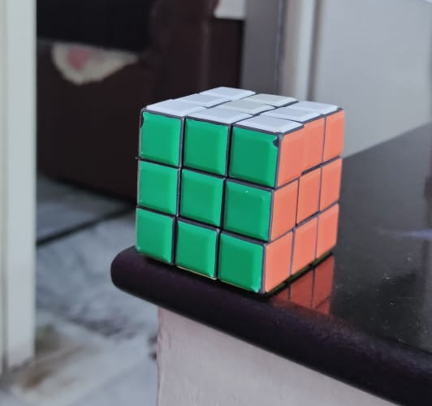

# Welcome to OpenCV Tutorial

## Installation
```sh
pip install opencv-python
```
# More Examples


### Duck


```sh
img = cv2.imread("duck_original.jpeg")
hsv = cv2.cvtColor(img, cv2.COLOR_BGR2HSV)
mask = cv2.inRange(hsv, (0, 0, 0), (220, 145,255))
```


### Rubix Cube



```sh
img = cv2.imread("rubic_original.jpeg")
hsv = cv2.cvtColor(img, cv2.COLOR_BGR2HSV)
mask = cv2.inRange(hsv, (0, 0, 0), (211, 182,187))
```


### Hand


```sh
img = cv2.imread("hand_original.jpeg")
hsv = cv2.cvtColor(img, cv2.COLOR_BGR2HSV)
mask = cv2.inRange(hsv, (2, 33, 90), (23, 216,255))
```


### Pink cup


```sh
img = cv2.imread("cup_original.jpeg")
hsv = cv2.cvtColor(img, cv2.COLOR_BGR2HSV)
mask = cv2.inRange(hsv, (0, 154, 0), (255, 255,255))
```


https://opencv-python-tutroals.readthedocs.io/en/latest/py_tutorials/py_imgproc/py_table_of_contents_imgproc/py_table_of_contents_imgproc.html
you can explore various filters and various techniques


ajin - inrange [0 0 0] [220 145 255] pink doll

tanuj - [0 0 0] [211 182 187] - rubixcube

jahnavi - [ 2 33 90] [ 23 216 255]  - hand

erin - (0,154,0) (255,255,255)  - pink mug


